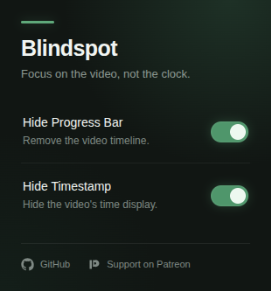
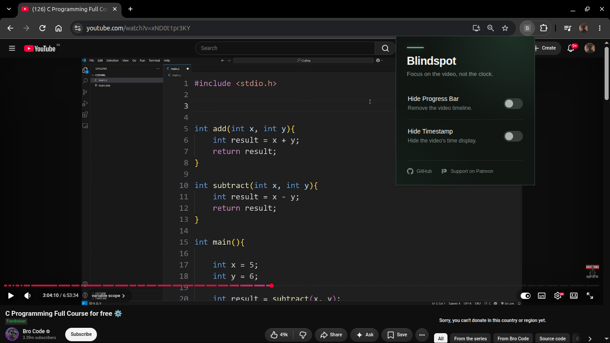
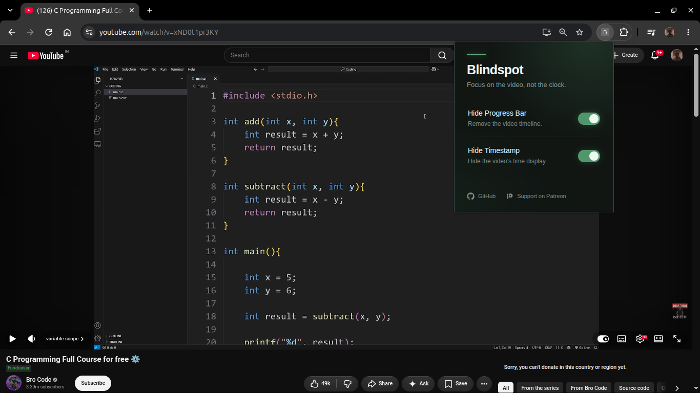

Blindspot

Blindspot is a Chrome extension that hides YouTube's **progress bar** and **timestamp** while watching videos.

The purpose is to remove the constant reminder of how much time is left, making it easier to focus on the video itself, especially when watching long lectures, tutorials, or other study material.

Features

- Hide YouTube progress bar
- Hide YouTube timestamp
- Toggle each feature independently
- Settings are saved locally

Installation

Blindspot is currently installed manually using Chrome's developer mode.

1. Download or clone this repository.
2. Open `chrome://extensions` in Chrome.
3. Enable **Developer mode**.
4. Click **Load unpacked**.
5. Select the `Blindspot` project folder.

The Blindspot icon will then appear in the Chrome extensions menu.

Usage

1. Open a YouTube video.
2. Open the Blindspot extension.
3. Turn **Hide Progress Bar** and/or **Hide Timestamp** on.
4. Turn them off whenever the information is needed again.
5. If the features don't work, simply turning them on and off once or twice will get them working.

Images
## Preview

About Me

A CS student building projects to learn, experiment, and build a software development portfolio.

GitHub: https://github.com/sugar-strikes  
Support me on Patreon: https://www.patreon.com/sugarstrikes

Made by Sugar.
